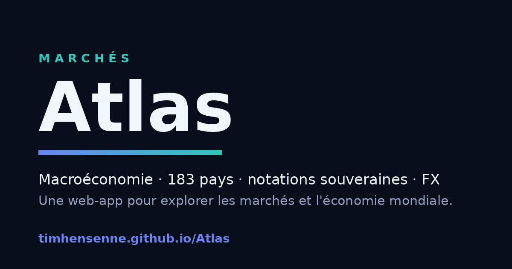

# Atlas

**A macroeconomic web app to explore global markets and the world economy.**
Interactive world map, a database of 183 countries, an in-house sovereign risk score, credit ratings, an FX converter, and a set of geography/economics games — bilingual (FR/EN).

🔗 **Live:** https://timhensenne.github.io/Atlas/



---

## Overview

Atlas is a self-contained, front-end macroeconomic dashboard. It pulls public data from the IMF, OECD/FRED and other public sources into static JSON files (refreshed monthly by an automated pipeline), then renders everything client-side — no server, no backend framework. It's a portfolio project built to combine financial-economics analysis with front-end engineering.

## Key features

- **Interactive world map** (D3 + Natural Earth projection) — click any country to open its profile.
- **Country profile** in three tabs: *Identity* (capital, currency, population…), *Economics* (GDP, growth, inflation, debt, budget, current account, unemployment — each with a sparkline and world/regional rank), and *Analysis* (the sovereign risk score).
- **Database** with three views:
  - *Table* — sortable, filterable, pin countries.
  - *Chart* — compare several countries' trajectories on one indicator.
  - *Scatter* — every country as a dot, two chosen indicators on X/Y, size ∝ GDP, colour = region, axes crossing at world medians (quadrant reading), with country search.
- **Sovereign risk score** — an in-house composite indicator (see below).
- **FX converter** with EUR/USD toggle applied across the whole app.
- **Games** — "Guess the country", "Guess the flag", and more, with Supabase-backed leaderboards.
- **Bilingual FR/EN**, persisted language & currency, shareable deep-links (e.g. `#view=map&c=EG&t=analysis`), light/dark theme.

## The sovereign risk score

The analytical centrepiece: a transparent, fundamentals-based composite (0–100, higher = riskier) computed from IMF World Economic Outlook data. It is **not** a black box — the full methodology is documented in-app.

Six weighted pillars:

| Pillar | Weight | Notes |
|---|---|---|
| Public debt | 25% | Logistic S-curve whose midpoint depends on income ("debt intolerance": tolerable debt rises with wealth), blended with the 5-year debt trend |
| Budget balance | 20% | 3-year average |
| Current account | 15% | 3-year average |
| Inflation | 15% | Worse of overheating / deflation + 5-year price volatility |
| Growth | 15% | 5-year potential + historical instability |
| Capacity | 10% | World percentile of GDP per capita (tax base & institutional proxy) |

On top of the weighted average, two capped interaction penalties model **snowball dynamics** (high debt + persistent deficit) and **twin deficits** (budget and current account both negative).

An **"all-or-nothing"** rule shows no score when a fundamental is missing, and a **divergence flag** appears when the fundamentals look benign but agency ratings (S&P / Moody's / Fitch) are speculative or worse — surfacing the political/institutional risk the macro data can't capture.

## Tech stack

- **Front end:** vanilla ES modules, D3.js, world-atlas TopoJSON, Geist fonts. No build step — a single `public/index.html`.
- **Data pipeline:** Node.js collectors → static JSON. Sources: IMF (macro), OECD/FRED (10-year yields), public sources for ratings and country identity.
- **Backend (minimal):** Supabase for auth and game leaderboards (login by email; public data guarded by Row-Level Security).
- **CI/CD:** GitHub Actions — a monthly job refreshes the data and commits it; a second workflow deploys `public/` to GitHub Pages.
- **Testing:** `tests.mjs`, a set of invariants (risk score bounds, card/model consistency, bilingual number formats, rank bounds, CSS balance) run with `npm test`.

## Data

- **183 countries** with macro indicators (IMF WEO), **162** with sovereign ratings.
- Refreshed automatically on the 1st of each month.
- Displayed on an "all-or-nothing" basis — a country's data is only shown when its key indicators are all present, to avoid misleading partial figures.

## Run locally

```bash
npm install
npm start        # serves public/ on http://localhost:3000
```

Refresh the data (optional — needs network access to the sources):

```bash
npm run data     # macro + identity + yields + ratings
```

Run the invariant tests:

```bash
npm test
```

## Project structure

```
Atlas/
├─ public/               # the deployed site
│  ├─ index.html         # the whole app (HTML + CSS + JS)
│  ├─ macro.json         # IMF macro data
│  ├─ countries.json     # country identity
│  ├─ yields.json        # 10-year yields
│  ├─ ratings.json       # sovereign ratings
│  ├─ atlas-config.js    # Supabase config (publishable key)
│  └─ og.png · favicon.svg · robot.png · tim.jpg
├─ fetch-*.mjs           # Node.js data collectors
├─ tests.mjs             # invariant tests
├─ supabase-atlas.sql    # database schema
└─ .github/workflows/    # data refresh + Pages deploy
```

## Author

**Tim Hensenne** — M.Sc. Financial Economics, Maastricht University.
Built as a portfolio project to develop and demonstrate skills before entering the job market.

*Data for information only — not investment advice.*
